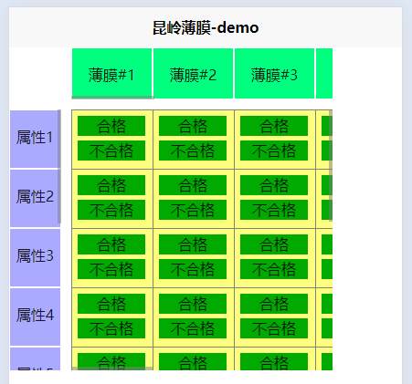

# 操作步骤：

- 先将项目克隆到本地
- 用HBuilder 打开项目
- 点击运行到浏览器

# 说明：

介绍：

1. content区域【表格区域】
2. top区域【表格上方横向滚动区域】
3. left区域【表格左侧垂直滚动区域】

功能：

1. 横向滚动或垂直滚动表格区域时，top和left区域会产生联动效果
2. 横向滚动top区域，content区域【表格区域】会产生联动效果
3. 垂直滚动left区域，content区域【表格区域】会产生联动效果
4. 当点击表格中某个单元格的【合格】【不合格】按钮时，会在console中打印是哪一行哪一列的合格或不合格

# 相关截图：

